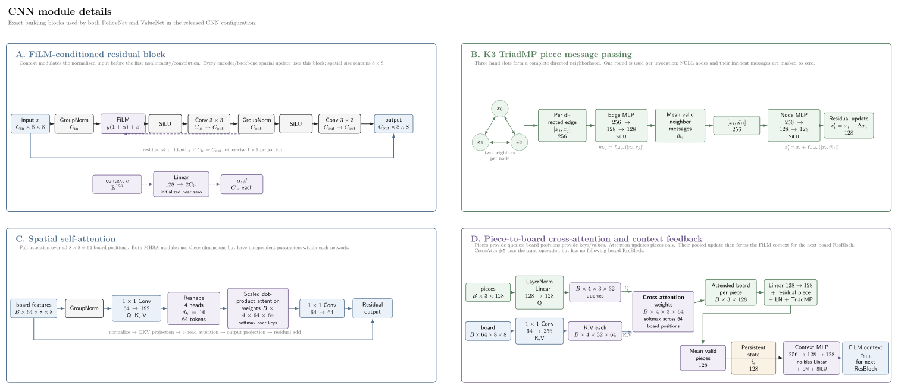
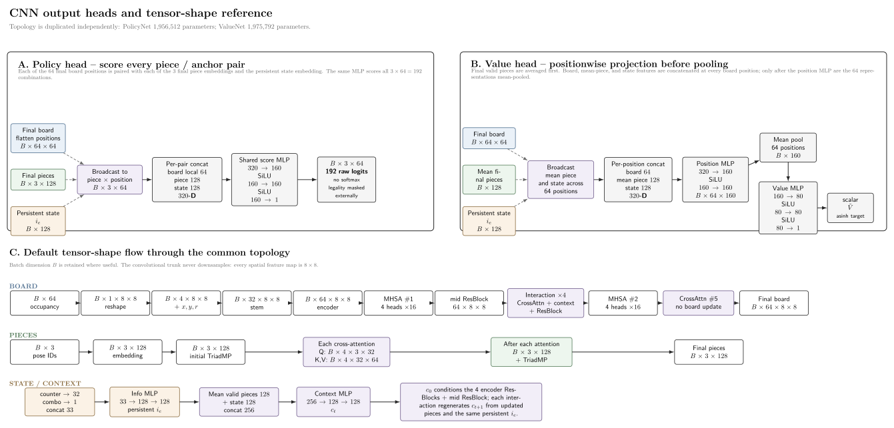
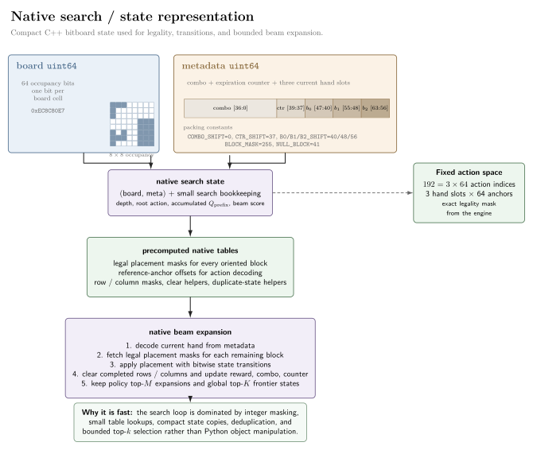
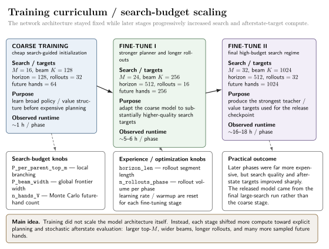

# Block Blast AI

A reinforcement-learning and policy-guided search system for **Block Blast**, built with **PyTorch, C++, and pybind11**.

The final agent does not attempt to learn the game end-to-end. Instead, it learns a **policy prior** for proposing promising placements and a **value function** for evaluating unresolved frontier states, then performs explicit short-horizon planning with a high-throughput native beam-search engine.

> **Learn what is expensive to calculate; search over what is cheap to enumerate.**

<p align="center">
  
</p>

<p align="center">
  <em>Agent gameplay demonstration. Quantitative results below use the fixed simulator benchmark.</em>
</p>

The released system combines:

* separate policy and value neural networks;
* an **afterstate formulation** separating player decisions from future random hands;
* policy-guided depth-3 beam search;
* hard-max search backups and frontier value bootstrapping;
* explicit Monte Carlo evaluation of hand-boundary chance states;
* common-random-number sampling for stable stochastic value targets;
* a C++ bitboard simulator and search engine;
* a Pygame simulator renderer;
* an experimental P4M / D4-equivariant architecture;
* and a Windows real-game controller using screen segmentation and calibrated mouse input.

<!-- TODO: Add demo GIF/video here -->

---

## Contents

* [Results](#results)
* [Quick Start](#quick-start)
* [Why Block Blast?](#why-block-blast)
* [Final Algorithm](#final-algorithm)

  * [Afterstates and stochasticity](#afterstates-and-stochasticity)
  * [Policy-guided beam search](#policy-guided-beam-search)
  * [Search backups and policy targets](#search-backups-and-policy-targets)
  * [Value learning](#value-learning)
* [Model Architecture](#model-architecture)

  * [Model inputs](#model-inputs)
  * [Policy network](#policy-network)
  * [Value network](#value-network)
* [Environment and Benchmark Definition](#environment-and-benchmark-definition)

  * [State representation](#state-representation)
  * [Action encoding](#action-encoding)
  * [Block distribution](#block-distribution)
  * [Scoring](#scoring)
  * [Evaluation protocol](#evaluation-protocol)
  * [Simulator benchmark vs. the commercial game](#simulator-benchmark-vs-the-commercial-game)
* [Native C++ Engine](#native-c-engine)
* [Training and Reproducibility](#training-and-reproducibility)

  * [Three-stage training curriculum](#three-stage-training-curriculum)
  * [Important hyperparameters](#important-hyperparameters)
  * [Hardware and runtime](#hardware-and-runtime)
  * [Training commands](#training-commands)
  * [Seeds and common random numbers](#seeds-and-common-random-numbers)
  * [Checkpoints and logs](#checkpoints-and-logs)
  * [Distributed training](#distributed-training)
* [Running the Pretrained Agent](#running-the-pretrained-agent)

  * [Native extension](#native-extension)
  * [Pygame renderer](#pygame-renderer)
* [Real-Game Autoplay](#real-game-autoplay)

  * [Screen capture and segmentation](#screen-capture-and-segmentation)
  * [Block recognition](#block-recognition)
  * [Action-to-mouse translation](#action-to-mouse-translation)
  * [Emulator calibration](#emulator-calibration)
* [Experimental P4M / D4-Equivariant Model](#experimental-p4m--d4-equivariant-model)
* [Research History](#research-history)
* [Repository Structure](#repository-structure)
* [Limitations](#limitations)
* [References](#references)

---

# Results

The released checkpoint is:

```text
chkpts/chkpt3
```

It is the checkpoint produced after zero-indexed training phase 3 of the final fine-tuning run and evaluated in the training log as **phase 4**.

Using the fixed simulator, fixed block-generation distribution, deterministic evaluation seed, and the released search configuration:

| Metric              |                 Result |
| ------------------- | ---------------------: |
| Mean score          |        **1,631,955.7** |
| Median score        |        **1,153,812.5** |
| Q25                 |              218,686.3 |
| Q75                 |            2,505,886.0 |
| Minimum             |                     71 |
| Maximum             |         **10,657,435** |
| Mean episode length | **1,395.6 placements** |

Evaluation configuration:

```text
evaluation seed      = 100003
evaluation games     = 256
maximum placements   = 3000
search depth         = 3
beam width           = 1024
top actions / parent = 32
search noise         = disabled
root action          = argmax
```

The following phase regressed substantially, so `chkpt3` was deliberately retained rather than simply taking the last checkpoint.

A much earlier experimental version of the project also produced a **~141M real-game run**, recorded in full over approximately five hours. That experiment used an earlier model/search configuration and a commercial-game scoring regime that is no longer stable, so it is treated as a historical demonstration rather than a directly comparable benchmark.

The fixed simulator result above is the primary reproducible performance claim for this repository.

---

# Quick Start

The repository targets **Python 3.12** and includes prebuilt x86-64 native extensions for tested Windows and Linux environments.

PyTorch must be installed before building `bbengine`.

For the original CUDA 13.0 training environment:

```bash
pip3 install torch torchvision --index-url https://download.pytorch.org/whl/cu130
```

`torchvision` happened to be installed in the original training environment but is not required by the current code.

If the bundled native extension is compatible with your system, no build step should be necessary.

Otherwise:

```bash
cd bbengine
pip install -v -e . --no-build-isolation
cd ..
```

### Run the pretrained agent in the simulator

Install Pygame:

```bash
pip install pygame
```

Then:

```bash
python render.py
```

By default, the renderer loads:

```text
chkpts/chkpt3
```

and automatically uses CUDA when available.

A different checkpoint or device can be selected with:

```bash
python render.py --checkpoint path/to/checkpoint --device cuda:0
```

---

# Why Block Blast?

Block Blast is a compact but surprisingly difficult stochastic planning problem.

The board contains only:

```math
8\times8=64
```

cells, yet a three-piece hand can expose up to:

```math
3\times64=192
```

fixed placement indices before legality masking.

A placement can simultaneously affect:

* immediate cells placed;
* rows or columns cleared;
* combo reward;
* remaining geometry;
* compatibility with the other pieces in the hand;
* survival under the next random hand;
* and long-term board flexibility.

A move that scores immediately can leave a strategically poor board. Conversely, a low-scoring move can create a much stronger position for the remaining pieces.

The early versions of this project tried to make the neural network learn all of this implicitly.

The central question eventually became:

> **Should the network learn to solve the entire game directly, or should it learn the quantities that make explicit search effective?**

The project converged strongly on the latter.

---

# Final Algorithm

The released agent is best described as a **learned heuristic search system**.

The policy network proposes useful branches.

The C++ simulator resolves game mechanics exactly.

Beam search explicitly compares short placement sequences.

The value network estimates what lies beyond the current search horizon and across future-hand chance boundaries.

<p align="center">
  
</p>

<p align="center">
  <em>End-to-end planning and training flow. Deterministic in-hand transitions are resolved explicitly by native search, while learned policy/value models guide branch selection and unresolved frontier evaluation.</em>
</p>

---

## Afterstates and stochasticity

Block Blast has a useful separation between **player-controlled decisions** and **environment randomness**.

For board $s$, current hand $h$, and legal action $a$:

```math
s'=T(s,h,a)
```

is deterministic.

The engine can compute exactly:

* legality;
* resulting occupancy;
* line clears;
* immediate reward;
* remaining pieces.

The player does not, however, control the next hand.

Randomness enters when the current hand has been exhausted and a new three-piece hand is generated.

This motivates an **afterstate value function**.

At a hand boundary, the value model learns approximately:

```math
V_{\mathrm{after}}(s')
\approx
\mathbb{E}_{h'\sim p(h)}
\left[
V(s',h')
\right]
```

The value network is therefore asked:

> **How good is the board I have created before I know the next random hand?**

rather than forcing it to entangle the consequences of the player's move with the particular stochastic hand that happens to follow.

This becomes the central decomposition of the final algorithm:

```text
current hand
     │
     ▼
explicit deterministic search
     │
     ▼
hand-boundary afterstate
     │
     ▼
learned expectation over future random hands
```

---

## Policy-guided beam search

The native search has a default depth of **three placements**, corresponding naturally to the maximum number of pieces in the current hand.

For each search node:

1. the native engine computes exact legality masks;
2. the policy network scores the 192 fixed action indices;
3. only the best $M$ legal actions are expanded;
4. the C++ engine applies each placement exactly;
5. duplicate successor states are eliminated;
6. only the best $K$ states survive to the next depth.

For the released checkpoint:

```math
D=3,\qquad M=32,\qquad K=1024
```

This changes the policy-learning problem substantially.

A direct policy ideally needs:

```math
\arg\max_a P_\theta(a\mid s,h)=a^*
```

A useful search prior only needs something closer to:

```math
a^*
\in
\mathrm{TopM}
\left(
P_\theta(\cdot\mid s,h)
\right)
```

If the optimal move is ranked fourth rather than first, explicit search can still recover it.

The neural network therefore acts as a **proposal mechanism**, while search performs the final tactical disambiguation.

### Beam retention

After the policy restricts the branching factor, the beam is ranked using the **exact accumulated in-hand reward**.

The value network is not repeatedly used to rank every intermediate search node.

Instead, it is reserved for states whose continuation cannot be fully resolved inside the search horizon.

This keeps the highest-frequency inner search operations inexpensive.

---

## Search backups and policy targets

A searched branch receives a final evaluation when it:

* reaches terminal failure;
* reaches a non-terminal hand boundary;
* or survives to the search horizon.

For terminal branches, the accumulated exact reward is sufficient.

For a non-terminal frontier state:

```math
Q_{\mathrm{leaf}}
=
R_{\mathrm{prefix}}
+
\gamma V_\phi(s_{\mathrm{leaf}})
```

with:

```math
\gamma=0.997
```

Search then performs a **hard-max backup** separately for each root action:

```math
L(a)
=
\max_{\mathrm{searched\ continuations\ beginning\ with}\ a}
Q
```

The objective is not to average the quality of all possible player decisions; the player explicitly chooses the strongest continuation search can find.

### No finalize-on-prune

Earlier search implementations could assign final meaning to a state when it fell outside the beam.

The released implementation does not.

Beam pruning means only:

> this branch no longer fits inside the current computational budget.

It does not imply that the state is terminal, solved, or otherwise semantically final.

This seemingly small distinction simplified the search substantially.

### Search as the policy teacher

Root action values are transformed into a teacher distribution:

```math
\pi_{\mathrm{search}}(a)
\propto
\exp
\left(
\frac{L(a)}{\tau}
\right)
```

over legal root actions.

The released configuration uses:

```math
\tau=2.0
```

The policy is trained by masked cross-entropy against this search-generated distribution.

Conceptually:

> **Search generates a stronger policy target; the policy learns to imitate the search and make future searches cheaper and better directed.**

During rollout generation, an action is sampled from this teacher distribution.

During evaluation, the root argmax is selected.

### Root exploration

Training search perturbs only the root proposal logits using Gumbel noise.

For policy logit $z_a$:

```math
z'_a
=
z_a+\epsilon G_a,
\qquad
G_a\sim\mathrm{Gumbel}(0,1)
```

The final training run used:

```text
P_root_eps = 0.5
```

before root top-$M$ selection.

Deeper search remains unperturbed, and evaluation disables search noise entirely.

---

## Value learning

The value model receives supervision from both ordinary trajectory states and explicit hand-boundary afterstates.

For trajectory states, discounted targets are constructed using GAE:

```math
\gamma=0.997,
\qquad
\lambda=0.99
```

The more interesting case is a completed-hand afterstate.

The next hand is unknown, so the trainer samples:

```math
h_1,\ldots,h_K\sim p(h)
```

For each sampled hand, the engine checks whether the hand is playable from the current board.

Playable hands are evaluated by the value network.

Hands that cannot be completed contribute zero continuation value.

The afterstate target is approximated by:

```math
\hat V_{\mathrm{after}}(s)
=
\frac{1}{K}
\sum_{k=1}^{K}
V(s,h_k)
```

The final fine-tuning stage uses:

```math
K=1024
```

future hands per afterstate.

Thus:

* deterministic consequences of the current hand are resolved through search;
* stochasticity beyond the current hand is learned through explicit Monte Carlo expectation targets.

### Heavy-tailed values

Block Blast returns are extremely heavy-tailed.

The value network therefore operates on:

```math
\tilde V
=
\mathrm{asinh}(V)
```

When raw-scale values are needed:

```math
V
=
\sinh(\tilde V)
```

`asinh` remains approximately linear for small values while compressing extreme returns strongly enough to make regression substantially easier.

---

# Model Architecture

The released system uses **separate policy and value networks**.

They use closely related architectures but do not share parameters.

Parameter counts:

```text
Policy network: 1,956,512
Value network:  1,975,792
```

<p align="center">
  
</p>

<p align="center">
  <em>PolicyNet and ValueNet use the same architectural topology but independent parameters. Piece embeddings query the spatial board through cross-attention, then feed information back into the board stream through FiLM conditioning.</em>
</p>

<details>
<summary><strong>Detailed CNN modules and tensor shapes</strong></summary>

<br>

<p align="center">
  
</p>

<p align="center">
  <em>Internal modules used by the CNN architecture.</em>
</p>

<br>

<p align="center">
  
</p>

<p align="center">
  <em>Policy/value output heads and tensor-shape reference.</em>
</p>

</details>

---

## Model inputs

Each network receives three groups of information.

### Board

The board is supplied as a flattened binary vector:

```math
x_{\mathrm{board}}
\in
\{0,1\}^{64}
```

It is reshaped internally to:

```math
1\times8\times8
```

Three fixed CoordConv-style maps are concatenated:

* normalized horizontal position;
* normalized vertical position;
* radial position.

The first spatial tensor therefore contains:

```text
occupancy
x coordinate
y coordinate
radius
```

This gives the convolutional network a small absolute spatial prior without requiring it to infer coordinates entirely from boundary effects.

### State metadata

Two scalar state variables are provided:

```text
combo
counter
```

The combo passes through `log1p`.

The counter uses a learned embedding.

### Current hand

The hand contains three oriented block IDs:

```math
(b_0,b_1,b_2)
```

There are:

```text
41 non-null oriented poses
+ 1 NULL sentinel
```

The null value is used after an individual piece has been consumed.

The conceptual network signature is therefore:

```math
f(
\mathrm{board}_{64},
\mathrm{state}_{2},
\mathrm{blocks}_{3}
)
```

---

## Policy network

Each current block receives a learned 128-dimensional embedding.

The three hand slots are then interpreted as a complete graph:

```math
K_3
```

`TriadMP` performs message passing among all three pieces.

This lets the embedding of one block depend on the other two.

For example, two individually easy pieces may compete for the same region of the board, while an awkward piece may need to be placed first because of the other pieces currently present.

### Spatial backbone

The board passes through a convolutional backbone containing:

* residual convolutional blocks;
* GroupNorm;
* SiLU nonlinearities;
* FiLM-style conditioning;
* spatial self-attention;
* repeated block-to-board cross-attention.

Block embeddings act as queries over spatial board features.

This gives the model an explicit mechanism for relating a particular piece to particular board locations.

The attended board information is then fed back into the piece representation before additional message passing.

Conceptually:

```text
board geometry
      ↕
spatial self-attention
      ↕
block ↔ board cross-attention
      ↕
K3 block message passing
```

### Policy output

The final policy scores:

```math
3\times64=192
```

piece/anchor combinations.

Legality is not learned.

The exact native environment produces the legal-action mask used by both training and search.

---

## Value network

The value network uses the same broad ingredients:

* CoordConv-style board representation;
* residual CNN backbone;
* learned block embeddings;
* $K_3$ message passing;
* state conditioning;
* spatial self-attention;
* block-to-board cross-attention.

Instead of producing action logits, the spatial features are pooled and passed through a scalar value head.

The policy and value networks are architecturally related but independently parameterized.

---

# Environment and Benchmark Definition

The fixed simulator is the authoritative research benchmark.

The current commercial Block Blast application is treated separately.

---

## State representation

The $8\times8$ occupancy grid fits exactly inside:

```text
uint64 board
```

The remaining game state fits in a second:

```text
uint64 meta
```

containing:

* combo;
* combo counter;
* three block slots.

Thus a logical environment state is represented compactly as approximately:

```text
(board_uint64, meta_uint64)
```

before search-specific cached information is considered.

This makes state copies, equality comparisons, hashing, and tree expansion extremely cheap.

<details>
<summary><strong>Exact native metadata bit layout</strong></summary>

The 64-bit metadata word is packed as:

| Field        |  Bits | Width | Shift |
| ------------ | ----: | ----: | ----: |
| Combo        |  0–36 |    37 |     0 |
| Counter      | 37–39 |     3 |    37 |
| Block slot 0 | 40–47 |     8 |    40 |
| Block slot 1 | 48–55 |     8 |    48 |
| Block slot 2 | 56–63 |     8 |    56 |

Equivalent masks:

```cpp
COMBO_MASK = (1ULL << 37) - 1;
CTR_MASK   = (1ULL << 3)  - 1;
BLOCK_MASK = (1ULL << 8)  - 1;
```

Packing:

```cpp
meta =
      (combo & COMBO_MASK)
    | ((ctr & CTR_MASK) << 37)
    | ((b0 & BLOCK_MASK) << 40)
    | ((b1 & BLOCK_MASK) << 48)
    | ((b2 & BLOCK_MASK) << 56);
```

The null-block sentinel is:

```text
NULL_BLOCK = 41
```

and easily fits inside the eight-bit block fields.

Initial metadata begins with:

```text
combo   = 0
counter = 3
```

The large 37-bit combo allocation is simply the space remaining in the compact 64-bit layout; practical combo values are enormously smaller.

</details>

---

## Action encoding

The action space contains:

```math
192=3\times64
```

fixed indices:

```math
a\in[0,192)
```

The selected hand slot is:

```math
\mathrm{slot}
=
a\gg6
```

The lower six bits identify the board anchor:

```math
\mathrm{anchor}
=
a\ \&\ 63
```

Therefore:

```text
0–63      → hand slot 0
64–127    → hand slot 1
128–191   → hand slot 2
```

Invalid piece/anchor combinations are masked by the native engine.

---

## Block distribution

The environment contains:

* **15 canonical block types**;
* **41 unique oriented poses** after deduplicating D4 symmetries.

Generation is conceptually:

1. select one of the 15 canonical block types uniformly;
2. select one of that block's distinct orientations uniformly;
3. repeat independently three times to form a hand.

Thus:

```math
P(B=b)
\approx
\frac{1}{15}
```

and conditional on canonical block $b$:

```math
P(P=p\mid B=b)
=
\frac{1}{n_b}
```

where $n_b$ is its number of unique D4 orientations.

The generator uses `SplitMix64`.

<details>
<summary><strong>Exact canonical block orbit sizes</strong></summary>

The 15 canonical bitboards generate exactly 41 unique poses.

| Canonical ID | Canonical bitboard | Cells | Distinct D4 poses | Global pose IDs |
| -----------: | -----------------: | ----: | ----------------: | --------------: |
|            0 |              `0x3` |     2 |                 2 |             0–1 |
|            1 |              `0x7` |     3 |                 2 |             2–3 |
|            2 |              `0xF` |     4 |                 2 |             4–5 |
|            3 |             `0x1F` |     5 |                 2 |             6–7 |
|            4 |          `0x70707` |     9 |                 1 |               8 |
|            5 |            `0x303` |     4 |                 1 |               9 |
|            6 |              `0x1` |     1 |                 1 |              10 |
|            7 |            `0x707` |     6 |                 2 |           11–12 |
|            8 |            `0x103` |     3 |                 4 |           13–16 |
|            9 |            `0x107` |     4 |                 8 |           17–24 |
|           10 |          `0x10107` |     5 |                 4 |           25–28 |
|           11 |            `0x102` |     2 |                 2 |           29–30 |
|           12 |          `0x10204` |     3 |                 2 |           31–32 |
|           13 |            `0x306` |     4 |                 4 |           33–36 |
|           14 |            `0x207` |     4 |                 4 |           37–40 |

The pose offsets are:

```text
[0, 2, 4, 6, 8, 9, 10, 11, 13, 17, 25, 29, 31, 33, 37, 41]
```

All orbit sizes belong to:

```math
\{1,2,4,8\}
```

The native canonical draw uses:

```cpp
rng.next_u64() % 15
```

rather than rejection sampling.

Because 15 does not exactly divide $2^{64}$, the canonical distribution technically contains a one-count modulo imbalance over the full $2^{64}$-value source space. This bias is negligible in practice.

Orientation selection has no such modulo imbalance because every orbit size divides $2^{64}$.

</details>

---

## Scoring

The simulator scoring system was reverse-engineered from the high-combo scoring behavior observed during the original development period.

Let:

* $n(b)$ = number of occupied cells in the placed block;
* $\ell$ = number of rows/columns cleared simultaneously;
* $c$ = combo before the placement.

Define:

```math
B(\ell)
=
\begin{cases}
0,&\ell=0,\\
10,&\ell=1,\\
10\ell(\ell-1),&\ell\ge2.
\end{cases}
```

If one or more lines are cleared, the combo first increments:

```math
c'=c+1
```

The placement reward is:

```math
r
=
n(b)
+
c'B(\ell)
+
300\,\mathbf{1}_{\mathrm{board\ clear}}
```

If no line clears:

```math
r=n(b)
```

The C++ environment is the authoritative implementation.

<details>
<summary><strong>Exact combo-counter transition rule</strong></summary>

The combo uses a separate three-bit expiration counter.

Let the old state be:

```text
combo   = c
counter = q
```

Each placement initially decrements the counter.

If a line is cleared:

```math
c'=c+1
```

and after the consumed piece is removed and the hand compacted:

```math
q'
=
3
+
\mathbf{1}_{b_0\ne\mathrm{NULL}}
+
\mathbf{1}_{b_1\ne\mathrm{NULL}}
```

Therefore:

```text
2 pieces remain → counter = 5
1 piece remains → counter = 4
0 pieces remain → counter = 3
```

If no line is cleared and the old counter was 1:

```math
c'=0,
\qquad
q'=3
```

Otherwise the combo is preserved and the counter simply decreases.

The line reward uses the incremented combo:

```math
r_{\mathrm{line}}
=
(c+1)B(\ell)
```

This allows a combo to survive several non-clearing placements rather than necessarily resetting immediately.

</details>

---

## Evaluation protocol

The released benchmark uses:

```text
256 evaluation environments
1 episode per environment
eval_seed = 100003
maximum placements = 3000
```

The search planner receives a separate deterministic seed derived from the evaluation seed and runs with exploration disabled.

The released checkpoint uses:

```text
search depth        = 3
beam width          = 1024
per-parent top-M    = 32
gamma               = 0.997
teacher temperature = 2.0
```

The evaluation action is:

```python
pi.argmax(-1)
```

rather than a sample.

The complete reported distribution is:

```text
phase 4
mean episode length = 1395.6094
mean score          = 1631955.7188

min =       71
q25 =   218686.25
q50 =  1153812.50
q75 =  2505886.00
max = 10657435
```

`max_placements_test=3000` should be kept in mind when interpreting unusually long games.

---

## Simulator benchmark vs. the commercial game

The simulator is the reproducible benchmark.

The live commercial game is not.

During the original January/February 2026 experiments, Block Blast **v9.1.4 on Google Play Games** exhibited a high-combo scoring regime that matched the simulator's implemented reward rule very closely.

Later testing found materially inconsistent live-game behavior:

* different multipliers across nearby versions;
* different scoring regimes after restarting games;
* and apparent changes even within individual games.

The underlying mechanism is unknown and should not be assumed to depend only on app version.

Consequently:

> **Current real-game scores are not treated as directly comparable to the fixed simulator benchmark.**

| Fixed simulator benchmark   | Commercial-game integration         |
| --------------------------- | ----------------------------------- |
| Fixed C++ environment       | External application                |
| Fixed block distribution    | Game-controlled behavior            |
| Fixed scoring               | Scoring can vary                    |
| Explicit RNG seeds          | External hidden state/configuration |
| Repeatable evaluation       | Emulator/UI dependent               |
| Primary quantitative result | Integration demonstration           |

<details>
<summary><strong>Historical real-game result</strong></summary>

An earlier experimental version of the system reached approximately:

```text
141M peak real-game score
```

during the original development period.

The complete run was recorded and lasts approximately five hours.

<!-- TODO: Link historical full recording -->

<!-- TODO: Link shorter highlight/demo -->

This run used an earlier experimental configuration and the commercial high-combo scoring regime observed at the time.

It is retained as evidence that the agent and real-game controller operated successfully on the commercial game, but it should not be compared numerically with the released fixed-simulator benchmark.

</details>

---

# Native C++ Engine

Search throughput became one of the central engineering constraints of the project.

The final system therefore moves nearly all high-frequency combinatorial work from Python into a C++20 extension exposed through pybind11 and PyTorch's extension infrastructure.

The native engine handles:

- bitboard state representation;
- block geometry;
- legality generation;
- state transitions;
- line clearing;
- reward computation;
- random hand generation;
- batched environments;
- policy top-$M$ selection;
- beam management;
- duplicate-state elimination;
- hard-max backup bookkeeping;
- common-random-number hand generation.

<p align="center">
  
</p>

<p align="center">
  <em>The complete logical environment fits into a board word and metadata word; precomputed masks and compact state transitions make large native beam expansions practical.</em>
</p>

### Precomputed move geometry

For every oriented pose, the engine precomputes information including:

* bit representation;
* cell count;
* legal empty-board anchors;
* reference position;
* relevant row/column masks;
* transformed orientations.

Legal placement testing can therefore be reduced largely to shifts, masks, and bitwise intersections rather than reconstructing geometry dynamically.

### Hybrid execution

The division of labor is:

```text
Python / PyTorch
        │
        │ batched policy/value inference
        ▼
 neural callbacks
        │
        ▼
C++ beam-search engine
        │
        ├── legality
        ├── top-M expansion
        ├── transitions
        ├── scoring
        ├── deduplication
        ├── beam pruning
        └── backups
        │
        ▼
candidate board/meta states
```

PyTorch remains responsible for flexible experimentation and learning.

The combinatorial inner loop remains native.

<details>
<summary><strong>Historical ~25× search optimization</strong></summary>

One major optimization pass reduced a search-heavy training iteration from roughly:

```text
~50 minutes
```

to approximately:

```text
~2 minutes
```

on the workload being profiled at the time.

This was roughly a **25× speedup**.

It came from several changes acting together:

* replacing Python board objects with compact bitboards;
* precomputing piece geometry and legal masks;
* using bitwise legality checks;
* examining only rows/columns touched by a placement;
* moving transitions into C++;
* aggressive policy top-$M$ pruning;
* bounded global beams;
* native duplicate-state elimination;
* simpler backup logic;
* removing unnecessary finalize-on-prune work;
* reducing Python/C++ traffic in the search loop.

The historical 25× figure is not intended as a benchmark between the current Python and C++ implementations; the older implementation no longer represents the current algorithm.

It is included because it was an important development result: **search representation and systems engineering changed the economics of the project more than many model-level changes did.**

</details>

---

# Training and Reproducibility

The released CNN was trained in three stages.

Each new stage loaded the policy/value weights from a previous checkpoint while beginning a new optimizer/scheduler configuration and using a substantially more expensive search/value-target setup.

---

## Three-stage training curriculum

<p align="center">
  
</p>

<p align="center">
  <em>The network architecture remained fixed while later stages progressively spent more compute on search, longer rollouts, and higher-quality stochastic value targets. Exact configurations are listed below.</em>
</p>

| Parameter                 |  Stage 1 — coarse | Stage 2 — fine-tune | Stage 3 — large-search fine-tune |
| ------------------------- | ----------------: | ------------------: | -------------------------------: |
| Starting model            |            random |   Stage-1 `chkpt35` |                 Stage-2 `chkpt2` |
| Worker environments       |               256 |                 256 |                              256 |
| Evaluation environments   |               256 |                 256 |                              256 |
| Horizon                   |               128 |                 512 |                              512 |
| Rollouts / phase          |                32 |                  16 |                               32 |
| Configured phases         |                40 |                  15 |                                5 |
| Future hands / afterstate |                64 |                 256 |                             1024 |
| Per-parent top-$M$        |                16 |                  24 |                               32 |
| Beam width                |               128 |                 256 |                             1024 |
| Maximum train batch       |              8192 |                8192 |                             8192 |
| Policy inference cap      |            40,000 |              35,000 |                           35,000 |
| Value inference cap       |           100,000 |             100,000 |                          100,000 |
| Policy LR                 | $5e{-4}\to5e{-5}$ |   $1e{-4}\to1e{-5}$ |                         $3e{-4}$ |
| Value LR                  | $3e{-4}\to3e{-5}$ |   $5e{-5}\to5e{-6}$ |                       $1.5e{-4}$ |
| Policy warmup             |                 0 |                 128 |                              128 |
| Value warmup              |                 0 |                 192 |                              192 |
| $\gamma$                  |              .997 |                .997 |                             .997 |
| GAE $\lambda$             |               .99 |                 .99 |                              .99 |
| Teacher temperature       |               2.0 |                 2.0 |                              2.0 |
| Root Gumbel scale         |                .5 |                  .5 |                               .5 |
| Approx. runtime / phase   |              ~1 h |              ~5–6 h |                      15.7–18.4 h |

The second stage was configured for 15 phases but was manually terminated after approximately nine.

The exact earlier training log was not retained.

Stage 3 did **not** start from the final Stage-2 checkpoint. It was initialized specifically from:

```text
chkpts_finetune/chkpt2
```

and then ran all five configured phases.

Its strongest balanced checkpoint was:

```text
chkpts_finetune2/chkpt3
```

which is published as:

```text
chkpts/chkpt3
```

The progression intentionally moved increasing amounts of compute into explicit planning and stochastic expectation estimation:

```text
future hands    64  →  256  → 1024
beam width     128  →  256  → 1024
top-M           16  →   24  →   32
horizon        128  →  512  →  512
```

---

## Important hyperparameters

The complete configurations remain in `main.py` and `config.py`.

### `P_beam_width`

Maximum number of search states retained after each expansion depth.

Larger beams preserve more alternatives but increase native search and neural-inference cost.

### `P_per_parent_top_m`

Maximum number of policy-ranked legal actions expanded from one parent.

This limits the local branching factor before global beam pruning.

### `n_hands_V`

Number of future hands sampled when constructing a hand-boundary afterstate target.

This became one of the most computationally expensive training parameters.

### `horizon_len`

Number of environment transitions in one rollout segment.

This is unrelated to the three-placement search depth.

### `n_rollouts_phase`

Number of rollout/update cycles performed before phase-level value training and evaluation.

### `V_gamma`

Discount used by search frontier bootstrapping and return construction:

```text
0.997
```

### `V_lmbda`

GAE parameter:

```text
0.99
```

### `P_teacher_tau`

Temperature applied to backed-up root search values before constructing the policy teacher:

```text
2.0
```

### `P_root_eps`

Scale of root Gumbel exploration during rollout search:

```text
0.5
```

### Batch-size caps

Training, policy inference, and value inference have separate batch caps.

This allows the search engine to construct large candidate populations while breaking neural evaluation into memory-safe batches.

<details>
<summary><strong>Exact learning-rate scheduler</strong></summary>

The trainer uses a custom cosine scheduler.

Let:

* $\eta_0$ = base learning rate;
* $\eta_{\min}$ = final learning rate;
* $W$ = warmup steps;
* $T$ = total scheduler steps.

During warmup:

```math
\eta(t)
=
\eta_0
\frac{t+1}{W},
\qquad
0\le t<W
```

After warmup, define:

```math
D=T-W
```

and:

```math
d=
\min
\left(
\max(t-W,0),
D
\right)
```

Then:

```math
\eta(t)
=
\eta_{\min}
+
(\eta_0-\eta_{\min})
\frac{1+\cos(\pi d/D)}{2}
```

The policy scheduler estimates:

```math
T_P
=
\left\lceil
\frac{
N_{\mathrm{env}}HR
}{
B_{\max}A_P
}
\right\rceil
N_{\mathrm{phases}}
```

where $A_P$ is policy gradient accumulation.

The value scheduler reserves approximately $4/3$ as many updates:

```math
T_V
=
\left\lfloor
\frac{4}{3}
\left\lceil
\frac{
N_{\mathrm{env}}HR
}{
B_{\max}A_V
}
\right\rceil
N_{\mathrm{phases}}
\right\rfloor
```

The additional value budget accounts for hand-boundary afterstate examples.

Approximate configured scheduler lengths:

| Stage        | Policy steps | Value steps | P warmup | V warmup |
| ------------ | -----------: | ----------: | -------: | -------: |
| Coarse       |        5,120 |       6,826 |        0 |        0 |
| Fine-tune I  |        3,840 |       5,120 |      128 |      192 |
| Fine-tune II |        2,560 |       3,413 |      128 |      192 |

In Stage 3:

```text
base_lr_P  = final_lr_P = 3e-4
base_lr_V  = final_lr_V = 1.5e-4
```

so the post-warmup schedule is effectively constant.

Unused linear and exponential scheduler implementations also remain in `utils.py`.

</details>

---

## Hardware and runtime

The final large-search fine-tuning stage was performed on a rented single-GPU server:

```text
GPU:                NVIDIA GeForce RTX 5090
reported VRAM:      33.67 GB
compute capability: 12.0
PyTorch:            2.13.0+cu130
CUDA runtime:       13.0
cuDNN:              92000
```

TF32 is enabled for supported CUDA matrix operations.

Final-stage phase runtimes:

| Logged phase               | Approx. elapsed time |
| -------------------------- | -------------------: |
| Initial phase-0 evaluation |               54 min |
| Phase 1                    |               17.5 h |
| Phase 2                    |               15.8 h |
| Phase 3                    |               15.7 h |
| Phase 4                    |               18.4 h |
| Phase 5                    |               17.3 h |

Earlier observed runtimes were approximately:

```text
Stage 1: ~1 hour / phase
Stage 2: ~5–6 hours / phase
Stage 3: ~16–18 hours / phase
```

Only the full Stage-3 timing log was retained, so the earlier figures are intentionally reported as approximate.

<details>
<summary><strong>RTX 5090 inference batch-size probe</strong></summary>

At the beginning of a fresh run, rank 0 performs a diagnostic binary search for the largest policy/value forward batch that fits in GPU memory.

The search examines approximately:

```text
2048 → 131072 examples
```

and stops when the remaining range is at most 256 examples wide.

Synthetic probe inputs use approximately:

```text
board occupancy probability ≈ 0.60
combo                        ∈ [0, 9]
counter                      ∈ [1, 5]
random block IDs
30% null probability / slot
```

Five inference passes are attempted for each candidate size.

On the final RTX 5090 environment:

```text
Policy maximum probe: 44,132
Value maximum probe:  107,888
```

The production caps remained slightly below those values:

```text
max_bs_inference_P = 35,000
max_bs_inference_V = 100,000
```

These are hardware/software-specific diagnostics, not portable guarantees.

</details>

---

## Training commands

The original server workspace was:

```text
/workspace/block_blast
```

PyTorch was installed using:

```bash
pip3 install torch torchvision --index-url https://download.pytorch.org/whl/cu130
```

The native extension was then built:

```bash
cd /workspace/block_blast/bbengine
pip install -v -e . --no-build-isolation
```

Training:

```bash
cd /workspace/block_blast
python3 main.py
```

PyTorch needs to exist before building `bbengine` because the extension uses PyTorch's C++ extension infrastructure.

The historical configurations for all three training stages remain in `main.py`.

---

## Seeds and common random numbers

Training maintains separate deterministic seed streams for:

```text
PyTorch
environment generation
search exploration
common-random-number hand sampling
```

Phase seeds are derived from:

```text
base seed
phase
rank
stream ID
```

rather than allowing every component to consume one shared RNG stream.

Evaluation uses:

```text
eval_seed = 100003
```

### Common random numbers

Hand-boundary value targets use **common random numbers (CRN)**.

The sampled future hands for an afterstate are deterministically derived from:

```text
board
metadata
current CRN phase seed
```

so revisiting the same afterstate under the same phase seed produces the same Monte Carlo future-hand set.

This reduces unnecessary variation when comparing or repeatedly training on equivalent states.

<details>
<summary><strong>Exact CRN hashing implementation</strong></summary>

At the beginning of a phase:

```cpp
seed_rng(crn_seed);
```

internally stores:

```cpp
rng_seed = splitmix64(seed);
```

For afterstate $(B,M)$:

```cpp
uint64_t hash_state(uint64_t board, uint64_t meta) {
    uint64_t x =
        board ^
        splitmix64(meta + 0xD6E8FEB86659FD93ULL);

    return splitmix64(x);
}
```

A local generator is initialized with:

```cpp
SplitMix64 local_rng(
    hash_state(board, meta) ^ rng_seed
);
```

`SplitMix64` advances through:

```cpp
state += 0x9E3779B97F4A7C15ULL;

z = state;
z = (z ^ (z >> 30)) * 0xBF58476D1CE4E5B9ULL;
z = (z ^ (z >> 27)) * 0x94D049BB133111EBULL;

return z ^ (z >> 31);
```

Each canonical piece uses:

```cpp
canon = rng.next_u64() % 15;
```

then selects one of that canonical shape's distinct orientations.

Three such draws form one hand.

Thus the entire $K$-hand sample set is a deterministic function of:

```math
(
\mathrm{board},
\mathrm{metadata},
\mathrm{CRN\ phase\ seed}
)
```

</details>

Exact bitwise reproduction across arbitrary CUDA versions, GPUs, compilers, and PyTorch releases is not guaranteed.

The seed system is intended to make stochastic structure controlled and repeatable within a fixed software/hardware setup.

---

## Checkpoints and logs

A normal run writes:

```text
logs/
└── train.log

chkpts/
├── chkpt0
├── chkpt1
├── chkpt2
└── ...
```

Each checkpoint contains:

```text
checkpoint version
completed phase

policy state_dict
value state_dict

policy optimizer state
value optimizer state

policy scheduler state
value scheduler state

full Config hyperparameters
```

Checkpoint writes use a temporary file followed by `os.replace` so a failed write is less likely to leave a partially written checkpoint.

### Checkpoint numbering

The initial model is evaluated as:

```text
phase 0
```

After zero-indexed training phase 0, the model is evaluated as:

```text
phase 1
```

and saved as:

```text
chkpt0
```

Therefore:

```text
chkpt0 → completed_phase = 1 → phase-1 evaluation
chkpt1 → completed_phase = 2 → phase-2 evaluation
chkpt2 → completed_phase = 3 → phase-3 evaluation
chkpt3 → completed_phase = 4 → phase-4 evaluation
```

The released `chkpt3` therefore corresponds to the published phase-4 result.

### Starting a new fine-tuning stage

`start_path` loads:

```text
policy weights
value weights
```

while creating:

```text
fresh optimizers
fresh schedulers
new Config
new phase counter
```

This is how the three training stages were chained.

### Exact interrupted-run continuation

`resume_name` restores:

```text
model weights
optimizer states
scheduler states
completed phase
saved hyperparameters
```

and verifies configuration compatibility.

A fresh run truncates `train.log`.

A true resume appends to it.

---

## Distributed training

The code also supports **single-machine multi-GPU DDP**.

The released checkpoint was not trained this way; all production training reported above used one RTX 5090.

<details>
<summary><strong>DDP implementation details</strong></summary>

`DistributedRunner` launches one process per GPU through:

```python
torch.multiprocessing.spawn(...)
```

and initializes:

```text
backend     = NCCL
MASTER_ADDR = localhost
MASTER_PORT = 12355
```

Each rank owns a single CUDA device.

Policy/value models are wrapped with:

```python
DDP(
    model,
    device_ids=[rank],
    find_unused_parameters=False,
    broadcast_buffers=False,
)
```

Each process also owns:

* a native batch environment;
* its own rollout buffer;
* its own beam-search instance;
* rank-specific Torch/environment/search/CRN seeds.

Gradients synchronize through DDP while the rollout trajectories remain independently generated.

Only the designated base rank performs:

* device logging;
* GPU batch-size probing;
* evaluation;
* checkpoint writes.

Barriers surround these rank-0-only operations.

### Variable afterstate counts

Different ranks can encounter different numbers of hand-boundary chance states.

That would ordinarily produce different numbers of value batches and therefore different counts of synchronized backward calls.

The implementation prevents this by computing the local afterstate count and applying:

```python
dist.all_reduce(..., op=dist.ReduceOp.MIN)
```

to obtain the smallest count across all ranks.

Ranks with extra afterstates randomly subsample down to this common size.

This guarantees an equal number of value-training backward/optimizer steps on every process.

</details>

---

# Running the Pretrained Agent

The default released checkpoint is:

```text
chkpts/chkpt3
```

Both `render.py` and `autoplay.py` resolve it relative to the repository root.

---

## Native extension

The repository includes native source plus prebuilt CPython 3.12 x86-64 binaries for tested Windows and Linux environments.

Other Python/platform/PyTorch combinations should rebuild:

```bash
cd bbengine
pip install -v -e . --no-build-isolation
```

The native implementation requires C++20.

Because it is built using PyTorch's `CppExtension`, binary compatibility can depend on:

* Python version;
* operating system;
* architecture;
* PyTorch build.

The source code is therefore the authoritative portable implementation.

---

## Pygame renderer

`render.py` runs the pretrained agent entirely inside the fixed simulator.

Additional dependency:

```bash
pip install pygame
```

Run:

```bash
python render.py
```

Default checkpoint:

```text
chkpts/chkpt3
```

The renderer automatically selects CUDA when available and otherwise falls back to CPU.

Custom checkpoint/device:

```bash
python render.py \
    --checkpoint path/to/checkpoint \
    --device cuda:0
```

The bundled font lives at:

```text
assets/LeagueSpartan-Bold.otf
```

with a system-font fallback if unavailable.

<!-- TODO: Add renderer screenshot -->

---

# Real-Game Autoplay

`autoplay.py` is an experimental Windows integration for controlling the commercial game through visual observation and ordinary mouse input.

It is **not** part of the reproducible simulator benchmark.

Additional dependencies:

```bash
pip install numpy mss pywin32
```

The controller has been tested with:

* Google Play Games Beta;
* BlueStacks 5.

The implementation does not require internal game APIs or Android hooks.

It treats the commercial game as a visual interface:

```text
emulator window
      │
      ▼
MSS capture
      │
      ▼
grayscale conversion
      │
      ├── board segmentation
      └── tray segmentation
      │
      ▼
internal bitboard + block IDs
      │
      ▼
policy-guided search
      │
      ▼
action [0, 192)
      │
      ▼
engine slot → physical tray slot
      │
      ▼
Win32 mouse drag
```

---

## Screen capture and segmentation

The game client area is located using `win32gui`.

Pixels are captured using MSS.

BGRA pixels are converted to grayscale luminance:

```math
Y
=
0.2126R
+
0.7152G
+
0.0722B
```

The controller then applies a calibrated crop using:

```python
AREA_TOP
AREA_LEFT
```

### Board recognition

The expected center of each of the 64 cells is derived from the current client width relative to a reference calibration width.

A small patch around each expected cell center is sampled.

The median luminance is compared against:

```python
EMPTY_COL
```

to classify the cell as empty or occupied.

The resulting occupancy matrix is converted into the same 64-bit bitboard used by the simulator.

The currently committed empty-cell calibration is approximately:

```text
EMPTY_COL = 41.5442
```

An older observed value:

```text
35.6148
```

is retained because commercial-game colors have changed across versions.

These constants should not be assumed portable.

---

## Block recognition

Each physical tray slot has a calibrated region of interest.

For each ROI, the controller:

1. separates the rendered block from the tray background;
2. finds its extent;
3. samples a $5\times5$ mini-grid;
4. converts that pattern to a bit encoding;
5. normalizes its orientation representation;
6. matches it against the 41 known engine poses.

Transient game animations occasionally obscure the tray and produce invalid patterns.

Recognition errors are therefore recoverable: the controller waits briefly, captures a fresh frame, and retries instead of terminating immediately.

### Canonical vs. physical hand slots

When attaching in the middle of a hand, the visual tray may be:

```text
[NULL, NULL, block]
```

while the native environment compacts remaining pieces toward slot 0.

The controller therefore distinguishes:

```text
physical tray order
canonical engine hand order
engine slot → physical tray slot map
```

This allows an engine action selecting canonical slot 0 to correctly pick up a block physically located in tray slot 2.

---

## Action-to-mouse translation

The agent returns:

```math
a\in[0,192)
```

The controller extracts:

```math
\mathrm{engine\ slot}
=
a\gg6
```

and:

```math
\mathrm{anchor}
=
a\ \&\ 63
```

The canonical engine slot is translated through the physical-slot mapping.

Using:

* the block reference position;
* block center;
* board target center;
* calibrated pickup position;
* affine drag correction;

the action is converted into screen-space mouse coordinates.

The actual drag is performed through Win32 cursor/input APIs.

<details>
<summary><strong>Exact current mouse-drag implementation</strong></summary>

For physical block $b$:

```math
\mathrm{shift}
=
(a\ \&\ 63)
-
\mathrm{REF\_POS}[b]
```

The board coordinates used by the visual controller are:

```math
r_0
=
7-(\mathrm{shift}\gg3)
```

```math
c_0
=
7-(\mathrm{shift}\ \&\ 7)
```

After correcting for the geometric center of the block, let:

* $(x_0,y_0)$ = physical pickup;
* $(t_x,t_y)$ = desired board target;
* $c_y$ = observed lifted-piece center.

The calibrated destination is:

```math
x_1
=
x_0+
\frac{t_x-x_0}{1.45}
```

```math
y_1
=
y_0+
\frac{t_y-c_y}{1.45}
```

Client coordinates are transformed to absolute screen coordinates through `ClientToScreen`.

The current drag uses:

```text
20 interpolation steps
200 ms interpolation time
```

or approximately:

```math
10\ \mathrm{ms}
```

per interpolation point.

The full programmed sequence is approximately:

```text
move to pickup
sleep 10 ms

left button down
sleep 20 ms

20 × {
    move to interpolated point
    sleep 10 ms
}

sleep 20 ms

left button up
sleep 10 ms
```

The interpolated movement is therefore 200 ms, while total programmed sleeps are approximately **260 ms**, excluding Win32 execution overhead.

</details>

---

## Emulator calibration

Real-game control depends on:

* emulator layout;
* window size;
* scaling;
* side panels;
* advertisements;
* game version;
* current UI appearance.

The following are development-machine calibration examples:

| Environment                 | `AREA_TOP` | `AREA_LEFT` |
| --------------------------- | ---------: | ----------: |
| Google Play Games Beta      |        ~58 |           0 |
| BlueStacks 5, no side panel |        ~48 |           0 |
| BlueStacks 5, side panel    |        ~48 |        ~348 |

Most geometry is scaled against:

```text
MEASUREMENT_WIDTH = 576
```

using:

```math
s
=
\frac{\mathrm{current\ client\ width}}{576}
```

<details>
<summary><strong>Full current geometry calibration</strong></summary>

| Constant          |             Value | Meaning                      |
| ----------------- | ----------------: | ---------------------------- |
| `AREA_TOP`        |                58 | top crop                     |
| `AREA_LEFT`       |                 0 | left crop                    |
| `EMPTY_COL`       |           41.5442 | current empty-cell luminance |
| `BG_COL`          |            80.735 | tray background luminance    |
| `BOARD_LEFT`      |                36 | board left edge              |
| `BOARD_TOP`       |               184 | board top edge               |
| `CELL_SIZE`       |                62 | board-cell size              |
| `GAP_SIZE`        |                 2 | gap between board cells      |
| `BLOCK_TOP`       |               770 | tray ROI top                 |
| `BLOCK_LEFT`      |  `(48, 216, 384)` | tray ROI left positions      |
| `BLOCK_SIZE`      |                28 | tray mini-cell size          |
| `HALF_BLOCK_SIZE` |                14 | half tray mini-cell          |
| `TRAY_GAP`        |                 1 | mini-cell gap                |
| `PICKUP_X`        | `(118, 286, 454)` | physical pickup x positions  |
| `PICKUP_Y`        |               900 | pickup y                     |
| `BIG_CENTER_Y`    |               696 | lifted-piece vertical center |
| `AFFINE_X`        |              1.45 | x drag compensation          |
| `AFFINE_Y`        |              1.45 | y drag compensation          |

Classification uses a small local image patch rather than one raw pixel.

The current luminance value:

```text
41.5442
```

corresponds approximately to the current empty-cell appearance.

An older darker visual configuration produced:

```text
35.6148
```

These values are examples only.

</details>

The controller should be viewed as a proof-of-functionality integration rather than a general-purpose portable computer-vision system.

---

# Experimental P4M / D4-Equivariant Model

The repository also contains a custom symmetry-aware architecture in:

```text
model/p4mcnn.py
```

Block Blast has natural geometric D4 symmetry:

* four rotations;
* four reflected orientations.

The ordering of the three hand slots also admits an S3 permutation symmetry.

The experimental model is designed so that:

* the policy is **equivariant** under D4 × S3;
* the value is **invariant** under D4 × S3.

Its design follows the general group-convolution approach introduced by Cohen and Welling's 2016 G-CNN work, while the finite-group operations and layers used here were implemented specifically for this project.

<p align="center">
  
</p>

<p align="center">
  <em>The P4M variant lifts ordinary spatial features into an explicit eight-element D4 group representation and carries that symmetry through the board and piece pathways. The released checkpoint uses the conventional CNN because the group-equivariant model was substantially more expensive.</em>
</p>

### Verification

Run:

```bash
python test_equivariance.py
```

The test exhaustively enumerates:

```math
|D_4|\times|S_3|
=
8\times6
=
48
```

combined transformations.

Using double-precision networks, it checks policy equivariance and value invariance with a maximum absolute tolerance of:

```math
10^{-5}
```

### Why it was not trained

The implementation was mathematically successful but substantially more expensive than the ordinary CNN.

Given a finite compute budget, that compute was more effectively allocated to:

* larger beam search;
* more action proposals;
* more future-hand samples;
* longer training trajectories.

The released checkpoint therefore uses the conventional CNN.

The P4M implementation remains as an experimental research branch.

<details>
<summary><strong>P4M parameter counts and eight-way activation expansion</strong></summary>

Default parameter counts:

| Architecture     | Policy parameters | Value parameters |
| ---------------- | ----------------: | ---------------: |
| Conventional CNN |         1,956,512 |        1,975,792 |
| P4M              |         6,910,592 |        7,139,713 |

The P4M models are approximately:

```text
3.53× larger policy
3.61× larger value
```

by parameter count.

The activation cost grows more aggressively because regular group features carry an explicit group dimension:

```math
|D_4|=8
```

An abstract feature map:

```math
(B,C,H,W)
```

becomes:

```math
(B,C,8,H,W)
```

or equivalently for ordinary PyTorch convolution storage:

```math
(B,8C,H,W)
```

Thus a nominal 64-channel regular group representation physically carries:

```math
64\times8=512
```

orientation-indexed feature channels.

### Lifted convolution

The first group layer maps a normal image into D4-indexed features.

A learned base kernel:

```math
W
\in
\mathbb{R}^{
C_{\mathrm{out}}
\times
C_{\mathrm{in}}
\times
k
\times
k
}
```

is transformed into all eight rotations/reflections.

The eight filters share underlying parameters.

### Regular convolution

After the lift, both input and output carry the group dimension.

A regular group-convolution kernel effectively contains:

```math
C_{\mathrm{out}}
\times
C_{\mathrm{in}}
\times
8
\times
k
\times
k
```

learned parameters before spatial/group transforms construct the physical convolution bank.

The implementation combines:

* spatial transformation of filters;
* a precomputed D4 multiplication table;
* inverse/group-index permutations.

The group ordering is:

```math
(e,r,r^2,r^3,s,rs,r^2s,r^3s)
```

where $r$ is a $90^\circ$ counter-clockwise rotation and $s$ is a reflection.

</details>

<details>
<summary><strong>Induced representation for oriented block embeddings</strong></summary>

The 41 oriented block IDs are not treated as unrelated categories in the P4M architecture.

For canonical block $b$, define its stabilizer:

```math
H_b
=
\{g\in D_4:g\cdot b=b\}
```

Its distinct poses form the coset space:

```math
D_4/H_b
```

with orbit size:

```math
n_b
=
\frac{8}{|H_b|}
```

The engine constructs:

```text
pose_off[b]     → first global pose ID for canonical b
g2pose[b, g]    → group element → unique local pose
pid2b[p]        → global pose → canonical block
pid2g[p]        → global pose → representative group element
```

Suppose global pose $p$ belongs to canonical block $b$ with representative $g_p$.

For every $g\in D_4$, the group-aware embedding looks up the pose corresponding to:

```math
gg_p
```

Conceptually:

```math
p_g
=
\mathrm{pose\_off}(b)
+
\mathrm{g2pose}(b,gg_p)
```

Instead of one categorical vector:

```math
e_p\in\mathbb{R}^{D}
```

the piece is represented as:

```math
E(p)
\in
\mathbb{R}^{8\times D}
```

For symmetric pieces, stabilizer-equivalent group positions naturally repeat the same unique pose.

The null block maps to the padding/null embedding in every group position.

The separate S3 symmetry over the three hand slots is handled through shared slot processing and permutation-equivariant `TriadMP` message passing.

</details>

---

# Research History

The released architecture emerged from a substantially broader set of RL/search experiments.

These approaches are documented because the final design was shaped as much by what failed as by what worked.

<details open>
<summary><strong>Expanded experimental history</strong></summary>

| Direction                  | Motivation                                          | Outcome                                                                      |
| -------------------------- | --------------------------------------------------- | ---------------------------------------------------------------------------- |
| Direct policy gradient     | Learn placement strategy end-to-end                 | Learned useful heuristics but struggled with combinatorial hand interactions |
| Actor-critic / A2C         | Add learned long-horizon baseline                   | Better signal, but planning remained implicit                                |
| PPO                        | Stabilize policy optimization                       | Strong baseline infrastructure; planning bottleneck remained                 |
| DQN / value-based variants | Learn direct action values                          | Structured action space and stochastic continuation remained difficult       |
| n-step returns             | Propagate reward further                            | Useful target improvement, not a planning solution                           |
| GAE                        | Control bias/variance                               | Retained in final value training                                             |
| Distributional critics     | Model heavy-tailed returns                          | Added complexity without replacing explicit lookahead                        |
| Nonlinear value transforms | Compress extreme returns                            | `asinh` survived into the final system                                       |
| Retrace                    | Reuse off-policy trajectories                       | Useful off-policy machinery, but not the central solution                    |
| V-trace                    | Alternative corrected off-policy targets            | Similar conclusion to Retrace                                                |
| Difficult-hand generator   | Train on unusually challenging block configurations | Useful conceptually, but indirect compared with searching actual decisions   |
| Counterfactual evaluation  | Compare alternative placements from one state       | Major step toward afterstate/search formulation                              |
| Afterstate learning        | Separate decisions from future randomness           | Became a core idea                                                           |
| Broader/deeper tree search | Resolve tactical sequences                          | Useful but expensive without aggressive pruning                              |
| More complex backups       | Extract more information from search trees          | Simpler hard-max/frontier logic proved more robust                           |
| Policy-guided top-$M$      | Restrict search to plausible moves                  | Became essential                                                             |
| Beam search                | Bound global tree growth                            | Became final planner                                                         |
| Larger CNNs                | Learn more strategy implicitly                      | Less cost-effective than spending compute on search                          |
| D4/P4M equivariance        | Encode spatial symmetry exactly                     | Numerically correct but too expensive for final training budget              |
| Native C++ search          | Remove Python inner-loop bottlenecks                | Essential for final throughput                                               |

The overall development progression was approximately:

```text
model-free RL
      │
      ├── PPO / actor-critic
      ├── n-step / GAE
      ├── distributional critics
      └── Retrace / V-trace
      │
      ▼
afterstate formulation
      │
      ├── counterfactual evaluation
      └── difficult-hand generation
      │
      ▼
policy + value heuristics
      │
      ▼
explicit search
      │
      ├── policy top-M
      ├── beam pruning
      ├── hard-max backup
      ├── frontier bootstrap
      ├── root exploration
      └── no finalize-on-prune
      │
      ▼
native C++ search engine
      │
      ▼
released system
```

</details>

The main conclusion was:

> **For a small environment that can be simulated extremely cheaply, computation spent on explicit planning can be more valuable than computation spent continually increasing neural-network complexity.**

The final system is neither a pure learned policy nor a conventional hand-written solver.

It is a **learned heuristic search system**.

---

# Repository Structure

```text
Block-Blast-AI/
│
├── main.py
│   └── training configurations / entry point
│
├── config.py
│   └── experiment hyperparameters
│
├── core.py
│   ├── model construction
│   ├── local / DDP training
│   ├── checkpointing
│   └── phase seed management
│
├── worker.py
│   ├── rollout collection
│   ├── search-generated policy targets
│   ├── GAE / afterstate targets
│   └── evaluation
│
├── memory.py
│   └── rollout buffer
│
├── utils.py
│   ├── checkpoints
│   ├── logging
│   ├── LR schedulers
│   └── state packing / unpacking
│
├── render.py
│   └── Pygame simulator visualization
│
├── autoplay.py
│   └── Windows real-game controller
│
├── test_equivariance.py
│   └── exhaustive D4 × S3 verification
│
├── model/
│   ├── cnn.py
│   │   └── released policy/value networks
│   ├── p4mcnn.py
│   │   └── experimental equivariant models
│   └── group.py
│       └── finite-group utilities
│
├── policy_math/
│   ├── returns.py
│   ├── value_scale.py
│   └── mirror.py
│
├── bbengine/
│   ├── bindings/
│   │   └── pybind.cpp
│   ├── src/
│   │   ├── engine.cpp
│   │   ├── env.cpp
│   │   ├── search.cpp
│   │   ├── tables.cpp
│   │   └── ...
│   ├── bbengine/
│   │   ├── __init__.py
│   │   ├── _bbengine.cp312-win_amd64.pyd
│   │   └── _bbengine.cpython-312-x86_64-linux-gnu.so
│   ├── setup.py
│   └── pyproject.toml
│
├── chkpts/
│   └── chkpt3
│       └── released checkpoint
│
└── assets/
    └── LeagueSpartan-Bold.otf
```

---

# Limitations

### Commercial-game scoring is unstable

The current commercial game does not provide a stable scoring benchmark across observed versions/sessions.

The fixed simulator should be used for quantitative comparison.

### Autoplay is calibration-specific

`autoplay.py` depends on:

* Windows;
* emulator/window geometry;
* calibrated pixel values;
* visual UI stability;
* Win32 input APIs.

It is an integration demonstration rather than a general computer-vision controller.

### Training is expensive

The final training stage required approximately 16–18 hours per phase on one RTX 5090.

### Search-heavy inference

The released model intentionally trades inference compute for stronger planning:

```text
beam width = 1024
top-M      = 32
depth      = 3
```

This is much more expensive than direct policy execution.

### Evaluation cap

Evaluation stops after at most 3000 placement iterations.

Extremely long games may therefore be administratively truncated.

### Hardware-level determinism

Major random streams are explicitly controlled, but exact floating-point identity is not guaranteed across arbitrary:

* GPUs;
* CUDA versions;
* PyTorch versions;
* compilers.

### P4M checkpoint

The P4M implementation is tested for equivariance but does not include a fully trained production checkpoint.

---

# References

**Taco S. Cohen and Max Welling.**
*Group Equivariant Convolutional Networks.*
ICML, 2016.

https://proceedings.mlr.press/v48/cohenc16.html

---

# Disclaimer

This is an independent research and engineering project and is not affiliated with or endorsed by the developers of Block Blast.

The local simulator and fixed benchmark environment are provided for experimentation and reproducibility.

The commercial-game controller is included only as an external integration demonstration.
